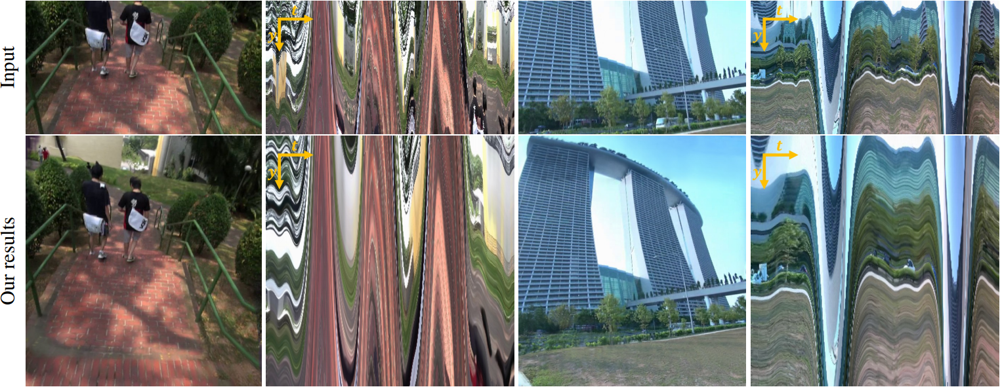

# [ICCV 2020] FuSta: Hybrid Neural Fusion for Full-frame Video Stabilization
### [Project Page](https://alex04072000.github.io/FuSta/) | [Video](https://www.youtube.com/watch?v=KO3sULs4hso) | [Paper](https://arxiv.org/abs/2102.06205) | [Google Colab](https://colab.research.google.com/drive/1l-fUzyM38KJMZyKMBWw_vu7ZUyDwgdYH?usp=sharing)



Existing video stabilization methods often generate visible distortion or require aggressive cropping of frame boundaries, resulting in smaller field of views. In this work, we present a frame synthesis algorithm to achieve full-frame video stabilization. We first estimate dense warp fields from neighboring frames and then synthesize the stabilized frame by fusing the warped contents. Our core technical novelty lies in the learning-based hybrid-space fusion that alleviates artifacts caused by optical flow inaccuracy and fast-moving objects. We validate the effectiveness of our method on the NUS, selfie, and DeepStab video datasets. Extensive experiment results demonstrate the merits of our approach over prior video stabilization methods.

## Setup

Setup environment for [Yu and Ramamoorthi 2020].
```
cd CVPR2020CODE_yulunliu_modified
conda create --name FuSta_CVPR2020 python=3.6
conda activate FuSta_CVPR2020
pip install -r requirements_CVPR2020.txt
./install.sh
```

Download pre-trained checkpoints of [Yu and Ramamoorthi 2020].
```
wget https://www.cmlab.csie.ntu.edu.tw/~yulunliu/FuSta/CVPR2020_ckpts.zip
unzip CVPR2020_ckpts.zip
cd ..
```
Setup environment for FuSta.
```
conda deactivate
conda create --name FuSta python=3.6
conda activate FuSta
conda install pytorch=1.6.0 torchvision=0.7.0 cudatoolkit=10.1 -c pytorch
conda install matplotlib
conda install tensorboard
conda install scipy
conda install opencv
conda install -c conda-forge cupy cudatoolkit=10.1
pip install PyMaxflow
```

## Running code

Calculate smoothed flow using [Yu and Ramamoorthi 2020].
```
conda activate FuSta_CVPR2020
cd CVPR2020CODE_yulunliu_modified
python main.py [input_frames_path] [output_frames_path] [output_warping_field_path]
```
e.g.
```
python main.py ../../NUS/Crowd/0/ NUS_results/Crowd/0/ CVPR2020_warping_field/
```

Run FuSta video stabilization.
```
conda deactivate
conda activate FuSta
cd ..
python run_FuSta.py --load [model_checkpoint_path] --input_frames_path [input_frames_path] --warping_field_path [warping_field_path] --output_path [output_frames_path] --temporal_width [temporal_width] --temporal_step [temporal_step]
```
e.g.
```
python run_FuSta.py --load NeRViS_model/checkpoint/model_epoch050.pth --input_frames_path ../NUS/Crowd/0/ --warping_field_path CVPR2020CODE_yulunliu_modified/CVPR2020_warping_field/ --output_path output/ --temporal_width 41 --temporal_step 4
```

## Evaluation metrics

Please refer to `metrics.py` for the calculation of metrics C/D/S and `metrics_A.py` for metric A. 
The implementation of `metrics.py` is modified from [DIFRINT](https://github.com/jinsc37/DIFRINT/blob/master/metrics.py) with the help of [Stefan Klut](https://github.com/stefanklut).
Also, note that the calculation of metrics C/D/S might fail and result in Nan or numbers larger than 1.0 evaluating some compared stabilization methods.
This is due to the lack of feature points or the failure of homography estimation.
We only average the scores of the video sequences that all compared methods successfully pass the metric calculations.

## Citation

```
@inproceedings{Liu-FuSta-2021,
    title     = {Hybrid Neural Fusion for Full-frame Video Stabilization}, 
    author    = {Liu, Yu-Lun and Lai, Wei-Sheng and Yang, Ming-Hsuan and Chuang, Yung-Yu and Huang, Jia-Bin}, 
    booktitle = {Proceedings of the IEEE/CVF International Conference on Computer Vision}, 
    year      = {2021}
}
```

## Acknowledgements

Parts of the code were based on from [AdaCoF-pytorch](https://github.com/HyeongminLEE/AdaCoF-pytorch).
Some functions are borrowed from [softmax-splatting](https://github.com/sniklaus/softmax-splatting), [RAFT](https://github.com/princeton-vl/RAFT), and [[Yu and Ramamoorthi 2020](http://jiyang.fun/projects.html)]
